class: middle, slide_title


# Cours Web 🚀

## Introduction réseaux & backend 🕸️

<p><strong><i>Basile Marchand</i></strong> — adapté par <strong><i>Raphaël Prasquier</i></strong><br>MINES Paris - Université PSL</p>

---

layout: true


<div class="slide_footer">
    <div class="wrap">
        <span>2025 - <i> Réseaux & Backend</i>
        - <a class="current-slides" href="slides1.html">1: Réseaux</a>
        </span>
    </div>
</div>

---

# Le monde d'aujourd'hui — ultra connecté 🕸️

.center[
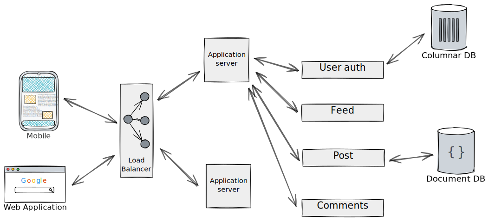
]

La plupart des systèmes informatiques que vous utilisez quotidiennement ne sont pas **une** application mais un **ensemble** d'applications qui interagissent entre elles.

---

# Premier use-case

## Le compteur de likes 👍

Vous likez une vidéo YouTube. Le compteur passe de **1 203 456** à **1 203 457**.

Ce chiffre est le même pour **tout le monde** sur terre, en temps réel.

.center[
<div style="display: inline-flex; align-items: center; gap: 12px; background: #f2f2f2; padding: 12px 24px; border-radius: 24px; font-size: 28px; margin: 10px 0;">
  👍 <strong style="font-family: Roboto, sans-serif;">1 203 457</strong>
  &nbsp;&nbsp; 👎
</div>
]

--

.center[
❓ Où vit ce compteur ? Pourquoi pas dans votre navigateur ? ❓
]

--

- Si le compteur vivait dans votre navigateur, chaque visiteur aurait **son propre** compteur
- Il faut un **programme central** qui maintient la valeur et la distribue à tout le monde
- Ce programme, c'est un **serveur** — un backend

---

# Un second use-case

## Le formulaire du prof 📝

Un prof met en ligne un formulaire de feedback. **30 élèves** répondent, chacun depuis sa machine. Le prof consulte ensuite **toutes les réponses** depuis la sienne.

.center[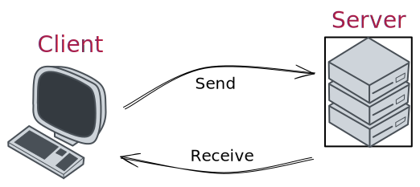]

--

.center[
❓ Trois acteurs (le prof, 30 élèves), un seul point central ❓
]

--

- Les élèves **écrivent** des données vers un endroit commun
- Le prof **lit** ces mêmes données depuis un autre endroit
- Il faut un **serveur** qui reçoit, stocke et redistribue

.center[
C'est exactement ce qu'on va construire dans ce cours 🚀
]

---

class: center, middle

# 👩‍🍳 Les ingrédients nécessaires 👨‍🍳

<br><br><br>
Des **applications** qui peuvent se **contacter**, <br><br> **échanger** des **données**
<br><br> avec des règles clairement établies permettant de **déclencher des actions**

---

# Dans ce cours

On va essayer de répondre aux questions suivantes

- Comment communiquer entre deux applications sur un réseau ?
- Comment envoyer un message d'une application vers une autre via le réseau ?
- Sous quel format envoyer ce message ?
- Comment fait-on une application **JavaScript** capable d'écouter sur le réseau ?

.center[

<iframe src="https://giphy.com/embed/l0HlRnAWXxn0MhKLK" width="480" height="348" frameBorder="0" class="giphy-embed" allowFullScreen></iframe>
]

---

# Architecture

Pour faire collaborer des applications ensemble il existe plein de modèles, d'architectures différentes

<div class="center">
  <iframe src="https://giphy.com/embed/JrSwnF7PLhgvmNfM8C" width="700p" height="348" frameBorder="0" class="giphy-embed" allowFullScreen></iframe>
</div>

On va regarder les plus classiques

---

## Client-serveur

.center[]

---

## Architecture trois-tiers

.center[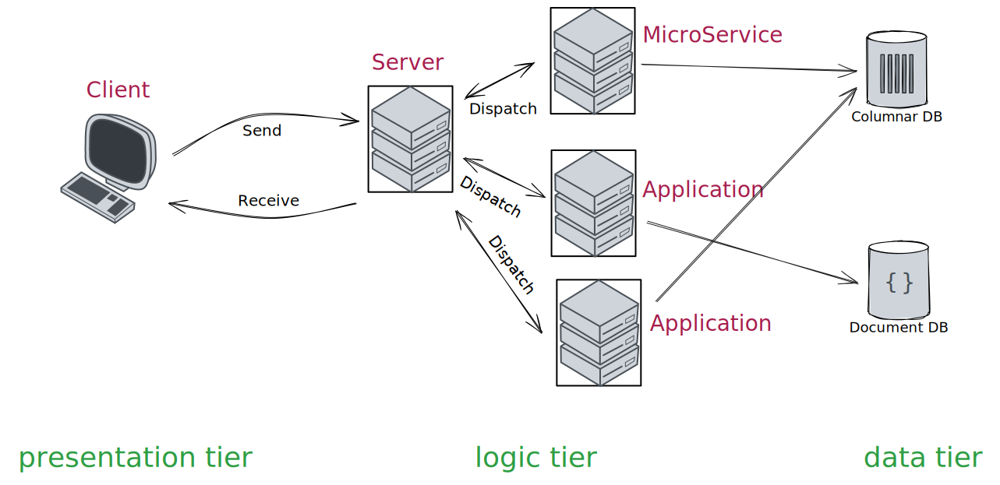]

---

## Architecture pair à pair

.center[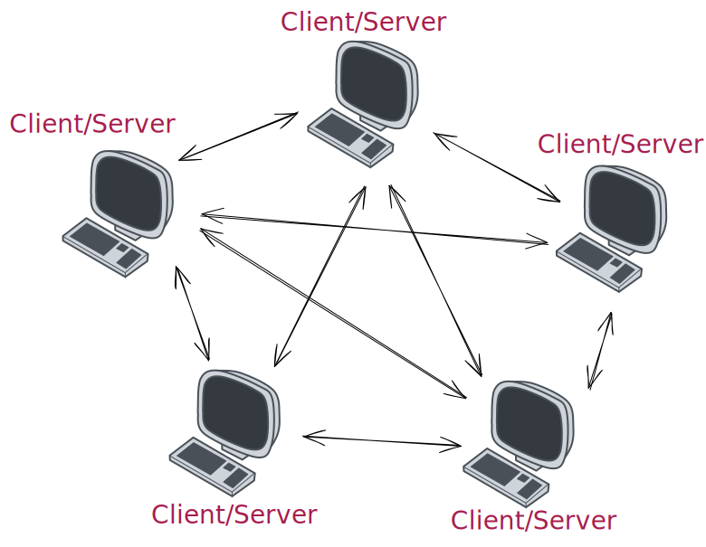]

Très à la mode à une époque où Netflix/Amazon Prime/... n'existaient pas (oui oui cette période est réelle 🤯)

---

# Le Web

.center[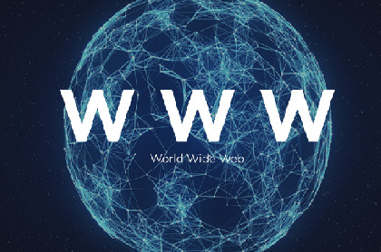]

.center[Juste un gros réseau]

---

# Le cloud

.center[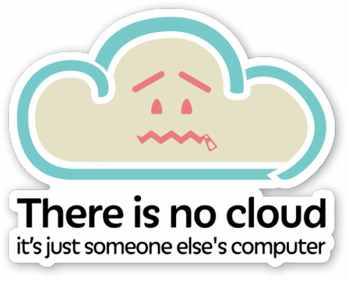
]

---

class: middle, center

# Le réseau : principe

---

# Réseau

## Infrastructure

Tout d'abord un réseau c'est quoi ?

.center[Et bien c'est une **infrastructure** que l'on utilise pour faire transiter des données.]

Dans sa version la plus élémentaire, un réseau est composé de deux appareils reliés entre eux, par un câble réseau par exemple.

Le point important : un appareil connecté au réseau doit posséder une **interface réseau**, un composant capable d'envoyer et recevoir un signal.

Par exemple votre ordinateur portable possède deux interfaces réseau : la prise RJ45 et la carte wifi.

.center[
**⚠️ L'appareil en lui-même n'a pas besoin de connaître la signification du signal, <br> c'est un programme tournant derrière l'interface réseau qui se charge de le traiter ⚠️**
]

---

# Réseau

## Différentes qualités

La qualité du réseau, un petit truc qui a son importance suivant l'application 🚀

.center[Toutes les connexions réseau ne se valent pas :]

<br>

- **Latence** : le temps pour qu'un message arrive
- **Bande passante** : la quantité de données par seconde
- **Pertes** : des paquets peuvent se perdre en route
- **Stabilité** : la connexion peut être intermittente

<br>
.center[
Pour une page web, quelques centaines de millisecondes changent déjà l'expérience.
<br>
⏳️ Sur de grosses applications, les échanges réseau représentent une part significative du temps total 💣
]

---

class: middle, center

# Un réseau et c'est tout ?

---

# Modèle OSI

.cols[
.fifty[

.center[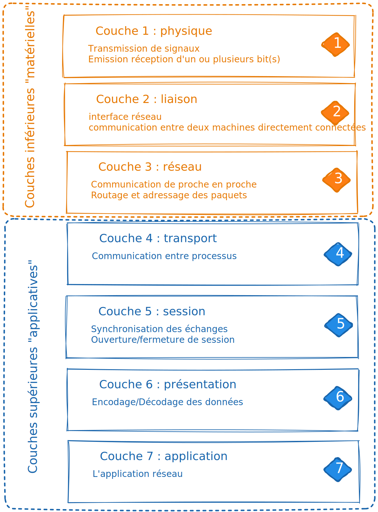]

]
.fifty[
<br><br><br>
**O**pen **S**ystem **I**nterconnexion
<br><br><br>

**norme** mise en place par le comité ISO en 1984
<br><br><br>

Objectifs :
<br><br><br>

.center[standardiser les communications<br> entre appareils sur un réseau]

]
]

---

# Adressage

.center[Associer à chaque interface de chaque machine sur un réseau une adresse unique]
<br><br>
Cette adresse peut être _temporaire_ ou bien _fixe_.
<br><br>
C'est ce qu'on appelle l'adresse IP, pour _Internet Protocol_. L'adresse IP d'une interface réseau s'écrit comme une combinaison de quatre nombres compris entre 0 et 255.
<br><br>
.center[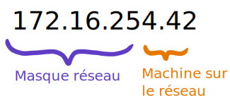]

.footnote.smaller[
il y a donc deux parties : l'adresse du réseau (souvent sur 24 bits) et l'adresse de l'hôte (souvent sur 8 bits)  
lorsqu'on a besoin d'écrire l'adresse d'un réseau on écrit alors le nombre de bits de l'adresse réseau
.center[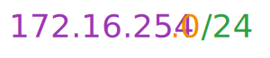]
]

---

## Adresses IPv6

**en 2011** on prévoit **l'épuisement 💣 des adresses IP** disponibles !...

2<sup>32</sup> = 4,294,967,296 c'est-à-dire environ 1/2 adresse par personne sur terre  
(bien sûr certaines personnes en ont plus que d'autres 😅)

Il a donc été mis en place le protocole **IP v6** (l'ancien protocole était le **v4**)

Le principe est simple : passer d'une adresse sur **32 bits** à une adresse sur **128 bits**  
par exemple (en hexa) `2001:0db8:0000:85a3:0000:0000:ac1f:8001`  
On a tellement d'adresses qu'on peut en donner une à chaque grain de sable sur terre 🏖️

<br>
Actuellement déployé **mais en partie** — principalement dans le cœur de réseau chez les opérateurs

Et pourquoi pas partout ?  
Le besoin d'IPv6 est moins important que prévu grâce notamment au NAT  
on en reparlera...

---

# Interconnexion

## Réseau local

.center[
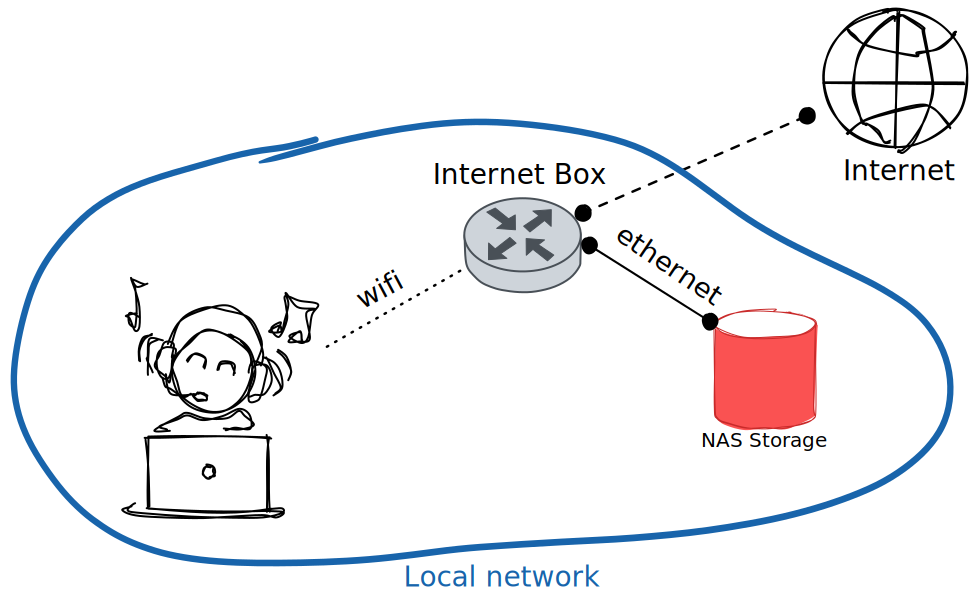
]

---

# Interconnexion

## Réseau distant

.center[
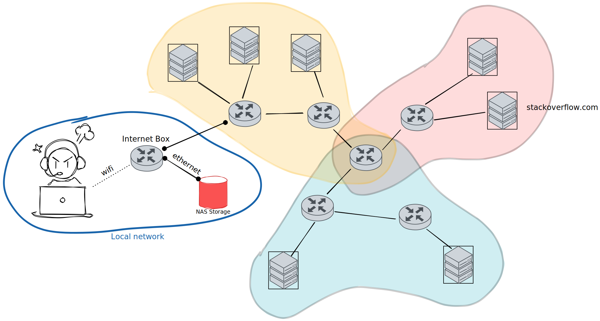
]

---

# Interconnexion

Pour résumer :
.center[interconnexion qui constitue en fait la troisième couche du modèle OSI]

gère trois éléments :
<br>

- Routage
  .center[
  chemin entre deux machines dans des réseaux différents, <br>passant par les passerelles (routeurs)<br>ces fameuses machines ayant des interfaces dans deux réseaux distincts.
  ]
- Relayage
  .center[s'occupe, une fois la route déterminée, <br>de faire transiter l'information de la machine A à la machine B]

- Contrôle de flux
  .center[fonctionnalité optionnelle mais néanmoins essentielle <br> qui permet de décongestionner le réseau. <br>Un peu le Waze du transit de données]

---

## C'est quoi mon IP ?

.cols[

.fifty[
Comment je fais pour connaître mon IP ?

Je demande à un site extérieur

```javascript
const response = await fetch(
  "https://api64.ipify.org?format=json"
)
const { ip } = await response.json()
console.log("Public IP:", ip)
```

Et j'obtiens (essayez !)
```bash
$ bun run my-public-ip.js
*Public IP: 138.96.202.10
```
]
.fifty[
Je demande à mon OS

```javascript
import os from "node:os"

const interfaces = os.networkInterfaces()
for (const [name, addrs] of Object.entries(interfaces)) {
  for (const addr of addrs) {
    if (addr.family === "IPv4" && !addr.internal) {
      console.log(`${name}: ${addr.address}`)
    }
  }
}
```

Et ça peut être différent !
```bash
$ bun run my-local-ip.js
*en0: 10.1.1.15
```
]
]

.footnote.small[depuis le terminal : `ipconfig` sur Windows, `ifconfig` sur macOS, `ip address show` sur Linux]

---

## Le NAT (Network Address Translation)

.cols[

.sixty-five[
Et mon petit doigt me dit que :

- vous allez tous avoir **la même adresse publique**
- mais pour la deuxième vous avez chacun une **adresse locale différente**

--

Il y a deux types d'adresses IP :

- publiques : visibles sur le réseau, **uniques**
- privées : utilisées **uniquement** dans un réseau local

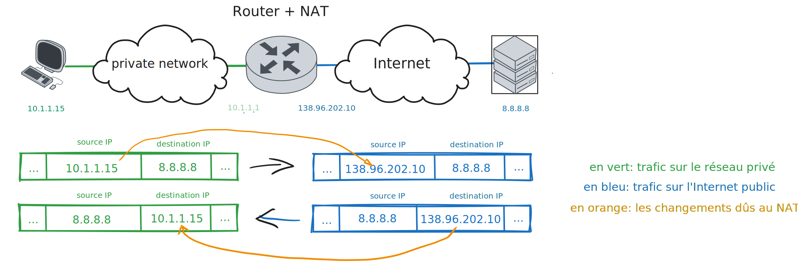
]

.thirty-five[
<br><br>
les adresses privées réservées :

- `192.168.0.0/16` <br> 2<sup>16</sup> = 65,536 adresses

- `172.16.0.0/12` <br> 2<sup>20</sup> = 1,048,576 adresses

- `10.0.0.0/8` <br> 2<sup>24</sup> = 16,777,216 adresses
]
]

---

# Les noms de domaines là-dedans !

Retenir les adresses IP c'est quand même pas super 🤯 !

.center[
Par exemple imaginez que vous deviez retenir `91.134.82.158` <br/>pour accéder à votre emploi du temps .... <strike>on ne vous verrait pas souvent !</strike>
]

--

Un truc magique :

.center[ **DNS** = **D**omain **N**ame **S**ystem]

Le service qui fait l'association entre un nom de domaine et une adresse IP.

--

.cols[

.fifty[
```bash
$ nslookup oasis.minesparis.psl.eu
Server:		192.168.0.1
Address:	192.168.0.1#53

Non-authoritative answer:
Name:	oasis.minesparis.psl.eu
*Address: 91.134.82.158
```
]

.fifty[

```bash
$ host oasis.minesparis.psl.eu
*oasis.minesparis.psl.eu has address 91.134.82.158
```

```bash
$ dig @8.8.8.8 oasis.minesparis.psl.eu A +noall +answer

;; global options: +cmd
*oasis.minesparis.psl.eu. 161	IN	A	91.134.82.158
```

]
]

---

class: center, middle

# On sait s'orienter, comment on cause maintenant ?

➡️ On a besoin de la 4ème couche du modèle OSI

---

# La couche transport 🚗

La quatrième couche du modèle

> spécification de comment on fait pour envoyer des données <br>
> d'un serveur A vers un client B et inversement.

Différents protocoles établis :

- TCP
- UDP
- ...

<br><br>
**⚠️ Attention ⚠️**
<br><br>
.center[
La couche transport ne fait que définir la ***manière*** dont deux applications communiquent
<br><br>
mais ne spécifie en rien le ***contenu*** de ces communications
]

---

# Un serveur == une application ?

Connaître l'IP du serveur ne vous permet pas encore de communiquer avec l'application qui se trouve sur ce serveur
<br>

.center[❓ D'ailleurs sur un serveur il ne peut y avoir qu'une application réseau ou peut-on en mettre plusieurs ❓]

--

.cols[

.seventy-five[
On peut avoir plusieurs applications sur un même serveur, et heureusement 🥳

Le choix de l'application avec laquelle on va discuter implique la notion de **_port_**

.center[ port = porte d'entrée du service 🚪]

Sur une machine on a 2<sup>16</sup> = 65,536

.center[(mais on ne fait pas tourner autant d'applications sur un serveur)]
]
.twenty-five[
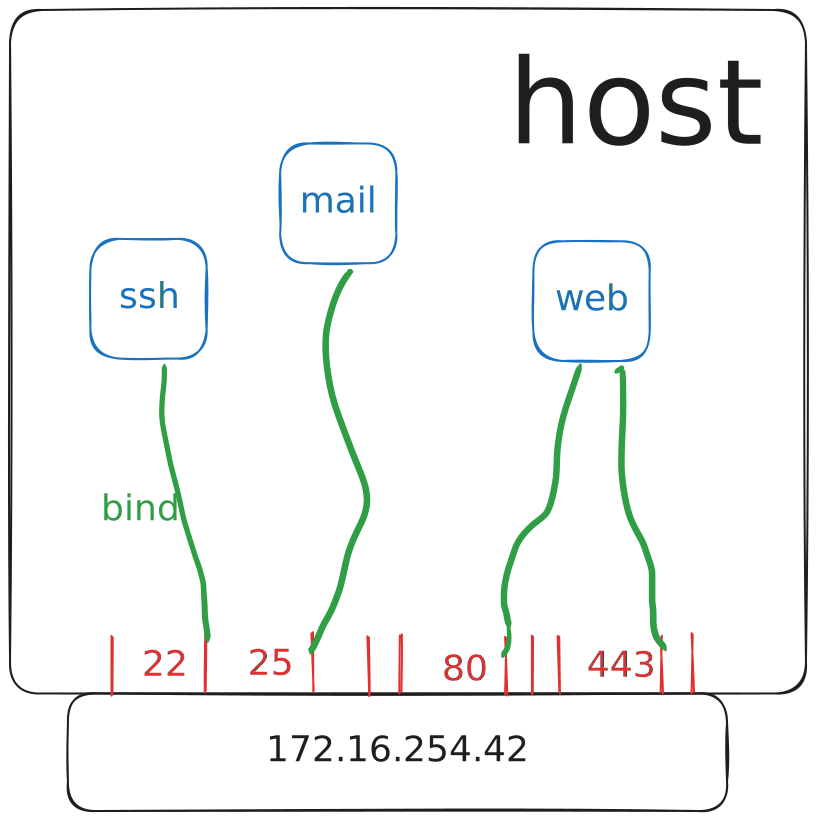
]
]

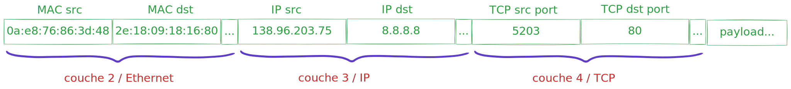

--

Quelques ports normalisés :

.center[22 : SSH, 25 : SMTP, 53 : DNS, 80 : HTTP, 443 : HTTPS]

---

# Bas niveau

## TCP/IP

.center[Transmission Control Protocol]
<br><br>
**Le** protocole historique (Bob Kahn et Vinton Cerf, Septembre 1973), qui doit sa longévité à sa robustesse et sa fiabilité.
<br>

.center[Aujourd'hui lorsque vous naviguez sur le web<br>la plupart des échanges entre votre navigateur et les sites web sont basés sur du TCP]

<br>
Le principe du TCP est très simple et se décompose en trois étapes :

--

- établissement de la connexion

--

- transfert de données

--

- fin de la connexion

---

# Bas niveau

## TCP/IP : open

.cols[
.fourty[
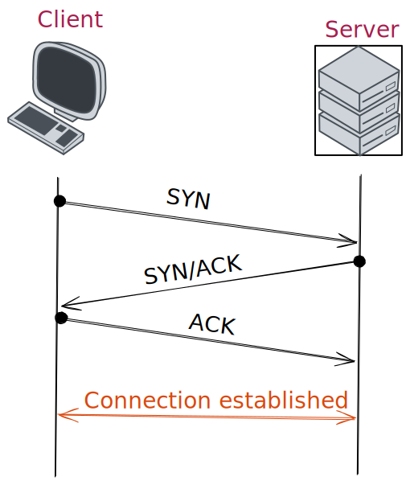
]
.fifty[
La connexion d'un client à un serveur TCP se décompose en trois étapes

.center[___three way handshake___]

de la manière suivante :

--

- 1️⃣ Client : Hello le serveur tu m'entends ? (**SYN**)

--

- 2️⃣ Serveur : Oui je t'entends et toi ? (**SYN-ACK**)

--

- 3️⃣ Client : Oui c'est bon je t'entends (**ACK**)

  ]
  ]

---

# Bas niveau

## TCP/IP : close

.cols[
.fifty[

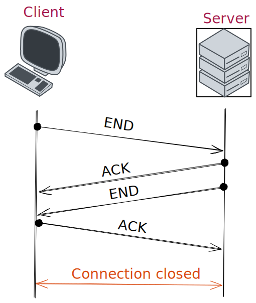

]
.fifty[
Clôture en 4 étapes
<br><br>

--

- 1️⃣ Client : j'ai fini (**FIN**)

--

- 2️⃣ Serveur : Ok c'est noté (**ACK**)

--

- 3️⃣ Serveur : moi aussi je n'ai plus rien à te dire (**FIN**)

--

- 4️⃣ Client : Ok à la prochaine (**ACK**)
  ]
  ]

---

# Bas niveau

## TCP un truc de riche 🤑

Vous pouvez donc voir qu'avec cette approche
<br><br>
.center[
✅ la connexion est extrêmement fiable et il y a peu de chances d'avoir des loupés
]
<br><br>
En revanche cette fiabilité n'est pas gratuite 💰️
<br><br>
.center[
❌ elle s'accompagne d'un coût en terme d'échanges relativement élevé]
<br><br>
C'est pour cela qu'il existe une alternative au TCP 😯

---

# Bas niveau

## UDP

Le protocole UDP (User Datagram Protocol) est complémentaire au protocole TCP. Créé par David Reed en 1980.

Cas d'usage :

.center[Transmission rapide de données et réception de l'intégralité **pas impérative**]

.center[

TCP = très fiable mais lent

*vs*
<br>

UDP = rapide mais peu fiable
]

--

Les applications :

.center[

]

---

# La couche 4 suffisante ou besoin de plus ?

<br><br>
.center[Avec TCP ou UDP on peut faire nos transferts de données entre applications]
<br>
.center[À votre avis c'est tout bon du coup ou on a besoin d'un truc en plus ?]
<br><br>

--

.center[ 🔎 Regardons sur un exemple concret 🔎 ]

Imaginez que vous créez votre propre protocole d'échanges au-dessus de TCP...

.center[
Rien de standard dans vos échanges de données 😵‍💫
<br><br>
Vous avez créé votre propre logique
<br><br>
mais elle ne l'est <strike>peut-être</strike> certainement pas aux yeux des autres.
]

--

<br>
.center[ Un peu de standardisation ne ferait pas de mal ... ]

---

# Au passage : transfert de données ...

.center[La grande question : <br><br>sous quel format échanger des données ❓]

<br>
Le modèle OSI ne spécifie pas vraiment de format de données autre que "c'est du binaire" 🤨
<br><br>

.center[
😩 Comment on fait si on veut faire transiter <br><br> un paquet de données structurées mais hétérogènes ?
]

Par exemple les informations d'une personne :

.center[Nom, Prénom, Date de naissance, nombre d'enfants, ...]

---

# Sérialisation JSON

.center[
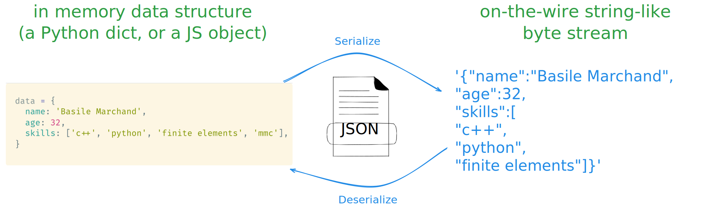
]

--

Via JavaScript c'est facile !

.cols[
.fifty[

```javascript
const data = {
  name: "Ada Lovelace",
  age: 36
}
const serialized = JSON.stringify(data)
```

]
.fifty[

```javascript
const serialized = '{"name": "Ada Lovelace", "age": 36}'
const data = JSON.parse(serialized)
console.log(data.name)
```

]
]

---

# Haut niveau : la couche 7 du modèle OSI

C'est là que les choses concrètes commencent 🥳
<br><br><br>
.center[***Couche 7 = couche Application***]
<br><br><br>
Chaque "catégorie" d'application spécifie alors :

.center[Comment se font les communications entre le client et l'application
<br><br>
format des messages, contenu attendu, ... ]

On parle de protocole :

- Transfert de fichiers 📂 : (S)FTP

- Messagerie ✉️ : SMTP, POP, IMAP

- Sessions distantes : telnet, SSH

---

# Protocole HTTP

Format d'une requête

.center[
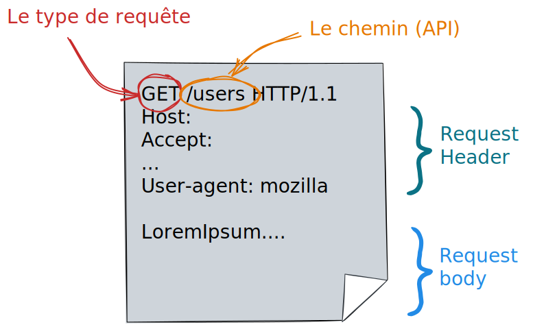
]

---

# Types de requêtes

Vous avez peut-être remarqué le `GET` dans la requête précédente.

En gros c'est pour dire que l'on veut faire une requête de type `GET`. Il existe d'autres types de requêtes :

--

- `GET` : requêtes pour **_obtenir_** du serveur une ressource (fichier html/css/js, image, vidéo, données, ...)

--

- `POST` : requêtes pour **_envoyer_** des données au serveur en vue d'un traitement (ajout d'un utilisateur, soumission de formulaire, ...)

--

- `PATCH` : requêtes pour **_modifier partiellement_** une ressource du serveur (mettre à jour l'email d'un utilisateur)

--

- `DELETE` : requêtes pour **_supprimer_** une ressource du serveur (supprimer un commentaire, ...)

<br>

.center[
⚠️ Il arrive souvent que `POST` soit utilisé, à la place de `PATCH`, <br> pour mettre à jour une donnée côté serveur ... 🤢
]

---

# Expérimentons

En JavaScript, `fetch` est disponible nativement — dans le navigateur comme dans Bun 🎉

```javascript
const response = await fetch("https://httpbin.org/get")
const data = await response.json()
console.log(data)
```

--

```javascript
const response = await fetch("https://httpbin.org/post", {
  method: "POST",
  headers: { "Content-Type": "application/json" },
  body: JSON.stringify({ name: "Ada", message: "Bonjour" }),
})
const result = await response.json()
console.log(result)
```

.center[
[httpbin.org](https://httpbin.org) met à disposition un serveur de test très pratique
]

---

# Les codes de retour

Lorsque l'on fait une requête à un serveur via HTTP/HTTPS, ce dernier nous renvoie un code de retour.

<br>
.center[Ces codes sont normalisés]
<br>
Voici un extrait des codes possibles :

--

- 200 : ok tout s'est bien passé ✅

--

- 301/302 : redirection de la page ⤴️

--

- 401 : il faut s'authentifier 🔐

--

- 403 : minute papillon tu n'as pas le droit d'accéder à ça ! ⛔

--

- 404 : ce que tu me demandes n'existe pas ⁉️

--

- 5XX : là c'est un problème de serveur 💣

<br>
La première chose à faire : vérifier que le code de retour est bien 200, sinon pas la peine de continuer !

---

# La notion d'API

.center[Application Programming Interface]

Permet de définir comment un programme **consommateur** va pouvoir exploiter les **fonctionnalités** d'un programme **fournisseur**

Dans le domaine du Web, l'API se définit à partir d'une URL. L'accès à la ressource se fait en effectuant une requête sur une URL particulière.

--

.center[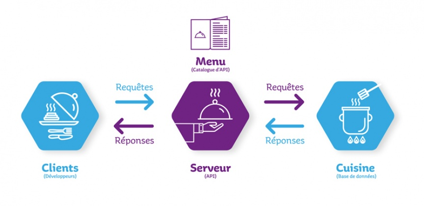]

.footnote[Image from Jérémy Mésière, Architecte Middleware chez Manutan]

---

# API REST

.center[**Representational State Transfer**]

Ensemble de principes gouvernant l'architecture d'applications Web.

.cols[
.fifty[

- **Méthodes HTTP** :

  Les opérations sont réalisées à l'aide des méthodes HTTP : GET (lire), POST (créer), PUT/PATCH (mettre à jour), DELETE (supprimer).

- Ressources :

  Toutes les données sont des "ressources".
  Chaque ressource est **identifiée** par une URI.
  Exemple : `/articles/123` représente l'article avec l'ID 123.
  ]
  .fifty[

- Sans état (**Stateless**) :

  Chaque requête doit **contenir toutes les informations nécessaires**. **Aucun état de session** n'est conservé sur le serveur.

- Représentation des ressources :

  Les ressources sont représentées en différents formats, JSON et XML étant les plus courants.
  Le choix du format est indiqué dans le header `Content-Type`.

  ]
  ]

---

# L'importance des headers HTTP

.center[
Les headers HTTP fournissent des informations essentielles sur la transaction HTTP.
]

Ils permettent de gérer l'authentification, le format des données, la version de l'API...

Quelques headers **_classiques_** :

- `Content-Type` : le type de média du corps de la requête ou de la réponse.
  <br> Dans le cadre des API REST, `application/json` est courant.
  <br><br>
- `Accept` : le type de contenu que l'on accepte en réponse.
  <br><br>
- `Authorization` : permet de gérer l'authentification lorsqu'on accède à une ressource protégée.

---

# Un mot sur l'authentification

Pour s'authentifier auprès d'une API REST, il faut à chaque requête fournir la preuve de qui l'on est. Cela passe généralement par un **token**.

.cols[
.fifty[

- Qui l'on est
- Ce que l'on a le droit de faire sur quelles ressources
  ]
  .fifty[

```bash
Authorization: Bearer <token>
```

]
]

L'obtention du token se fait généralement via l'interface Web du service visé.

.center[⚠️ Un token ne doit ***jamais*** être partagé 💣️]

Dans la plupart des cas, à un token est associé :

- Un ensemble de ressources accessibles
- Les droits sur ces ressources
- Une durée de validité

.center[Une solution pour conserver les tokens : un fichier `.env`]

---

# Une API utilisable est une API documentée

Si vous mettez en place un service Web avec une API et que vous souhaitez l'ouvrir vers l'extérieur, merci de prendre le temps de **documenter votre API** 📑.

On trouve en ligne plein d'API ouvertes :

.center[
[https://github.com/public-apis/public-apis](https://github.com/public-apis/public-apis)
]

---

# Illustration

Considérons un serveur générant des nombres aléatoires à la demande. L'API d'un tel serveur pourrait être :

- `/api/integer` renvoie un nombre aléatoire entier
- `/api/float` renvoie un nombre aléatoire flottant
- `/api/integer?n=100` renvoie 100 nombres aléatoires entiers

--

Avec Bun, ça donnerait :

```javascript
Bun.serve({
  port: 3000,
  fetch(request) {
    const url = new URL(request.url)
    if (url.pathname === "/api/integer") {
      const n = Number(url.searchParams.get("n") ?? 1)
      const numbers = Array.from({ length: n }, () => Math.floor(Math.random() * 1000))
      return Response.json(numbers)
    }
    return new Response("Not found", { status: 404 })
  },
})
```

---

# Par exemple

.center[Générer quelques statistiques sur GitHub]

```markdown

```


---

# Un mot sur le "No Code"

Depuis quelques années de plus en plus à la mode : **No Code**, **Low Code**

.center[
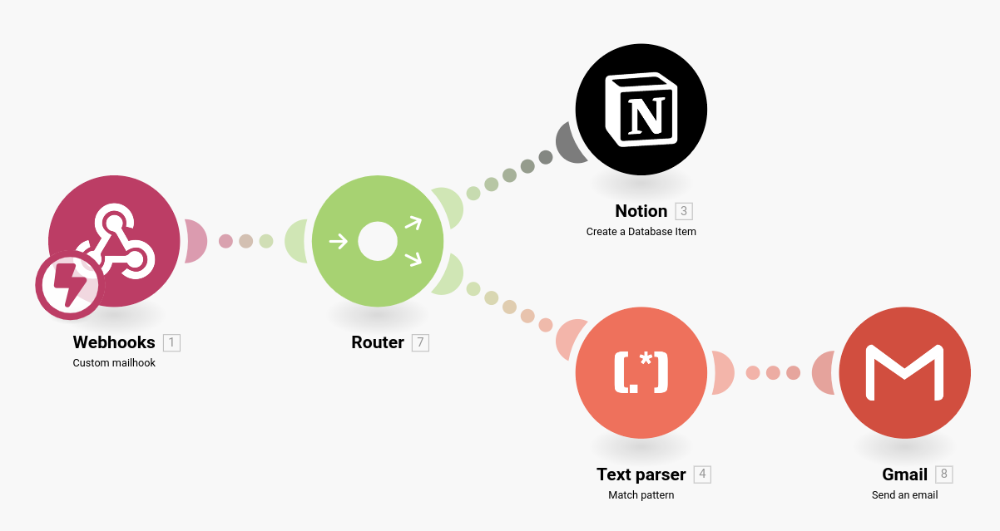
]

<br>
.center[
Demande de support par mail → nouvelle entrée en base de données <br>
→ notification si "urgent" dans le sujet 🤯
<br><br>
Nous, on code pour **comprendre** ce qu'il se passe vraiment.
]

---

class: middle, center

# Et concrètement, côté serveur ?

## On passe du côté obscur 🌑
## et on voit comment créer notre propre backend

---

# Premier serveur avec Bun

```javascript
Bun.serve({
  port: 3000,
  fetch(request) {
    return new Response("Bonjour depuis Bun 👋")
  },
})
console.log("Server running on http://localhost:3000")
```

--

.cols[
.fifty[
Tester dans le navigateur :
```
http://localhost:3000
```
]
.fifty[
Tester avec curl :
```bash
curl http://localhost:3000
```
]
]

--

.center[
**Idée clé : une requête entre, une réponse sort.** <br>
La fonction `fetch(request)` reçoit une `Request` et renvoie une `Response`.
]

---

# Routes et méthodes

```javascript
Bun.serve({
  port: 3000,
  fetch(request) {
    const url = new URL(request.url)

    if (url.pathname === "/" && request.method === "GET") {
      return new Response("Page d'accueil")
    }
    if (url.pathname === "/about" && request.method === "GET") {
      return new Response("À propos")
    }

    return new Response("Not Found", { status: 404 })
  },
})
```

On choisit quoi répondre selon l'**URL** et la **méthode HTTP**.

---

# Un formulaire HTML servi par Bun

```javascript
if (url.pathname === "/contact") {
  return new Response(`
    <h1>Contactez-nous</h1>
    <form method="POST" action="/submit">
      <input name="name" placeholder="Votre nom" required />
      <textarea name="message" placeholder="Votre message" required></textarea>
      <button type="submit">Envoyer</button>
    </form>
  `, { headers: { "Content-Type": "text/html; charset=utf-8" } })
}
```

--

.center[
Un formulaire HTML, c'est déjà une **machine à fabriquer une requête HTTP** `POST`.
<br><br>
Le navigateur s'occupe de tout : construire le body, envoyer la requête au bon chemin.
]

---

# Recevoir un formulaire côté serveur

```javascript
if (url.pathname === "/submit" && request.method === "POST") {
  const formData = await request.formData()
  const name = formData.get("name")
  const message = formData.get("message")

  return new Response(`
    <h1>Merci ${name} !</h1>
    <p>Votre message : ${message}</p>
    <a href="/contact">Retour</a>
  `, { headers: { "Content-Type": "text/html; charset=utf-8" } })
}
```

--

.center[
**Le cycle complet :**
<br><br>
formulaire HTML → body HTTP → `request.formData()` → validation → réponse
]

---

# Sauvegarder des soumissions

```javascript
const dataFile = "./submissions.json"

async function loadSubmissions() {
  try {
    return JSON.parse(await Bun.file(dataFile).text())
  } catch {
    return []
  }
}

async function saveSubmission(entry) {
  const submissions = await loadSubmissions()
  submissions.push({ ...entry, createdAt: new Date().toISOString() })
  await Bun.write(dataFile, JSON.stringify(submissions, null, 2))
}
```

Pour le cours, un fichier JSON local suffit. Ce n'est pas la solution la plus robuste en production, mais c'est parfait pour comprendre.

---

# Exposer une API JSON

```javascript
if (url.pathname === "/api/submissions" && request.method === "GET") {
  const submissions = await loadSubmissions()
  return Response.json({ ok: true, count: submissions.length, items: submissions })
}
```

--

.cols[
.fifty[
Tester avec curl :
```bash
curl http://localhost:3000/api/submissions
```
]
.fifty[
Tester avec fetch (navigateur ou Bun) :
```javascript
const res = await fetch(
  "http://localhost:3000/api/submissions"
)
const data = await res.json()
console.log(data.items)
```
]
]

--

.center[
**HTML et JSON sont juste deux réponses différentes à une requête.**
<br>
Le serveur décide du format selon la route.
]

---

# Pour aller plus loin : UDP + `nc`

Pour montrer que le réseau ne se résume pas à HTTP, voici un serveur UDP minimal :

```javascript
import { createSocket } from "node:dgram"

const socket = createSocket("udp4")

socket.on("message", (message, remote) => {
  const text = message.toString("utf8").trim()
  console.log(`Reçu "${text}" de ${remote.address}:${remote.port}`)
})

socket.bind(4001, "127.0.0.1")
console.log("UDP server on 127.0.0.1:4001")
```

--

Test :
```bash
echo "ping" | nc -u -w1 127.0.0.1 4001
echo "hello world" | nc -u -w1 127.0.0.1 4001
```

--

.center[
Pas de page web, pas de requête HTTP.
<br>
Juste des **datagrammes UDP** envoyés à un port.
<br><br>
HTTP n'est qu'**un protocole parmi d'autres** au-dessus du réseau.
]

---

# Ce qu'on a construit aujourd'hui

- Un modèle mental du réseau utile au web
- IP, DNS, ports, TCP vs UDP
- HTTP = requête / réponse au-dessus de TCP
- Un premier serveur Bun
- Un formulaire servi et reçu côté serveur
- Sauvegarde JSON + mini API
- UDP + `nc` pour voir au-delà de HTTP

---

class: center, middle

# La suite ❕

## On structure un vrai backend

### routes, templates, base de données, déploiement

.center[

<iframe src="https://giphy.com/embed/6x4CLjC8KofaU" width="469" height="380" frameBorder="0" class="giphy-embed" allowFullScreen></iframe>
]
